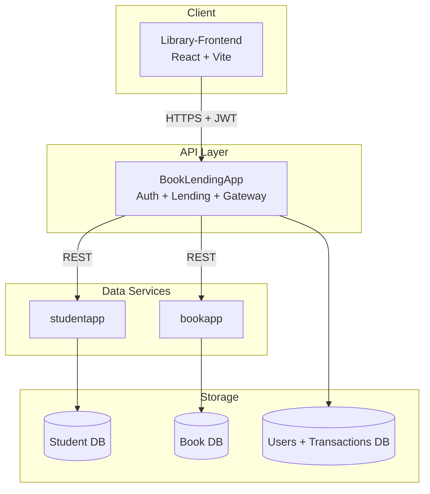
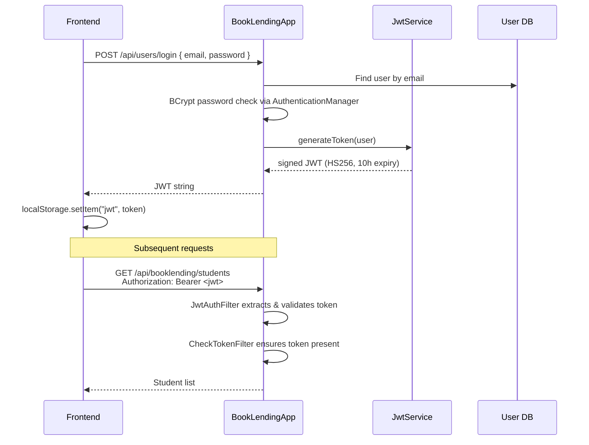

# College Library Project — Interview Preparation Guide

> **Team:** Dockerators (Kalyan Ram, Vidhish T, Vikas K)  
> **Event:** Afourathon Hackathon  
> **Repo:** [github.com/Vidhish-Trivedi/AcademiaArchive](https://github.com/Vidhish-Trivedi/AcademiaArchive)

---

## 30-Second Elevator Pitch

"We built a **microservices-based college library management system** where librarians manage students and books, and issue/return books. It has four services — two data microservices for students and books, one backend that handles authentication and lending logic, and a React frontend. The lending backend acts as an **API gateway**, proxying CRUD calls to the student and book services while managing its own lending transactions and user auth with **JWT + Spring Security**."

---

## 2-Minute Project Overview

### Problem

A college library needs to:
- Maintain a directory of **students** and **books** (separate concerns)
- Let **admins** onboard librarians
- Let **librarians** add/update/delete students and books, lend books to students, and process returns
- Track **who has which book** at any point in time

### Solution

We split the system into **four independently deployable services** in a monorepo:

| Service | Port | What it does |
|---------|------|--------------|
| `studentapp` | 8080 | Student CRUD microservice (Problem Statement 1) |
| `bookapp` | 8081 | Book CRUD microservice (Problem Statement 2) |
| `BookLendingApp` | 8082 | Auth, lending logic, API gateway to PS1/PS2 (Problem Statement 3 backend) |
| `Library-Frontend` | 5173 | React UI for admins and librarians (Problem Statement 3 frontend) |

### Why microservices?

- **Separation of concerns** — student data and book data are independent domains
- **Independent scaling** — book lookups may be more frequent than student updates
- **Hackathon constraint** — three problem statements mapped cleanly to three backends
- **Reusability** — `studentapp` and `bookapp` expose standalone REST APIs usable by any client

---

## Architecture



### Request path (example: librarian adds a student)

```
Browser → POST /api/booklending/students → BookLendingApp
         → POST /api/students → studentapp → H2/MySQL
         → response bubbles back through BookLendingApp → Browser
```

### Request path (example: lend a book)

```
Browser → POST /api/booklending/lendBook → BookLendingApp
         → checks local DB (is book already issued?)
         → saves BookLendingEntity (issued=true)
         → response to Browser
```

No call to `studentapp` or `bookapp` is needed for lending — only the lending service's own database is updated.

---

## Tech Stack

### Backend (all three Java services)

| Technology | Version | Purpose | Interview talking point |
|------------|---------|---------|----------------------|
| **Java** | 17 | Language | LTS version; records, pattern matching readiness |
| **Spring Boot** | 3.1.x | Application framework | Auto-configuration, embedded server, production-ready defaults |
| **Spring Web** | 3.1.x | REST APIs | `@RestController`, HTTP method mapping, JSON serialization |
| **Spring Data JPA** | 3.1.x | ORM / data access | Repository pattern; reduces boilerplate CRUD |
| **Hibernate** | (via JPA) | ORM implementation | Entity mapping, DDL auto-generation, dialect support |
| **H2 Database** | — | In-memory DB (local dev) | Fast setup; no external DB needed for development |
| **MySQL** | — | Production DB (AWS RDS) | Persistent, relational storage in deployed environment |
| **Spring Security** | 3.1.x | Auth & authorization | Filter chain, role-based access, password encoding |
| **JJWT** | 0.11.5 | JWT creation & validation | Stateless authentication; token in `Authorization` header |
| **Spring WebFlux / WebClient** | 3.1.x | Reactive HTTP client | Non-blocking calls for list endpoints (students, books) |
| **RestTemplate** | — | Sync HTTP client | Proxies single-resource CRUD to upstream microservices |
| **Lombok** | — | Boilerplate reduction | `@Data`, `@Builder`, `@RequiredArgsConstructor` |
| **SpringDoc OpenAPI** | 2.1.0 | API documentation | Swagger UI at `/swagger-ui/index.html` |
| **JUnit 5 + Mockito** | — | Unit & integration tests | Repo tests with H2; service tests with mocked repos |
| **Maven** | 3.9+ | Build & dependency management | Multi-module builds, wrapper (`mvnw`) for portability |

### Frontend

| Technology | Version | Purpose | Interview talking point |
|------------|---------|---------|----------------------|
| **React** | 18.2 | UI library | Component-based; hooks for state (`useState`, `useEffect`) |
| **Vite** | 4.3 | Build tool & dev server | Faster HMR than CRA; ESM-native |
| **React Router** | 6.12 | Client-side routing | `/login`, `/students`, `/books`, `/studentdetails/:id` |
| **Axios** | 1.4 | HTTP client | Interceptors, `withCredentials`, JWT in headers |
| **Tailwind CSS** | 3.3 | Utility-first CSS | Rapid UI development; responsive design |
| **Flowbite React** | 0.4.7 | UI component library | Pre-built modals, buttons, tables on top of Tailwind |
| **Material Tailwind** | 2.0 | Additional UI components | Used for form elements and buttons |

### DevOps & Deployment

| Technology | Purpose | Interview talking point |
|------------|---------|----------------------|
| **Docker** | Containerization | Each service has a `Dockerfile`; consistent runtime |
| **AWS ECS** | Container orchestration | Services run as ECS tasks on EC2 |
| **AWS ECR** | Container registry | Images built in CI and pushed to ECR |
| **AWS RDS (MySQL)** | Managed production database | Shared RDS instance; per-service schemas |
| **GitHub Actions** | CI/CD | `.github/workflows/aws.yml` builds, tests, deploys on push to `main` |
| **ECS Task Definitions** | Service configuration | `task-definition.json` per service defines CPU, memory, ports |

---

## Design Patterns & Principles

### 1. Controller → Service → Repository (all Java backends)

```
@RestController  →  @Service  →  @Repository (JPA)
     │                  │              │
  HTTP layer      Business logic    DB access
```

**Why?** Separates HTTP concerns from business rules from persistence. Easy to unit-test each layer independently.

### 2. API Gateway pattern (`BookLendingApp`)

The frontend only knows one backend URL. `BookLendingApp` proxies student/book CRUD to the correct microservice.

**Benefits:** Single entry point, centralized auth, frontend simplicity  
**Trade-off:** Extra network hop; gateway becomes a coupling point

### 3. Database per service

Each microservice has its own database (separate H2 schemas locally; separate tables on RDS in production).

**Benefits:** Loose coupling, independent schema evolution  
**Trade-off:** No foreign keys across services; lending service stores `rollNo` and `bookCode` as strings, not FKs

### 4. JWT stateless authentication

- Login → server returns JWT
- Client stores in `localStorage`
- Every request sends `Authorization: Bearer <token>`
- Server validates without server-side sessions

**Benefits:** Scalable, no session store  
**Trade-off:** Token revocation is harder; we use 10-hour expiry

### 5. Role-based access control (RBAC)

| Role | Permissions |
|------|-------------|
| `ADMIN` | Manage librarians (`/api/admin/**`) |
| `LIBRARIAN` | Manage students, books, lend/return |

Enforced in `JwtAuthFilter` — checks role from JWT claims before allowing admin routes.

### 6. SOLID — Interface + Implementation for services

```java
public interface StudentService { ... }
@Service
public class StudentServiceImpl implements StudentService { ... }
```

Allows mocking in tests and swapping implementations.

---

## Data Models

### Student (`studentapp`)

| Field | Type | Notes |
|-------|------|-------|
| `rollNo` | String (PK) | Unique student identifier |
| `name` | String | |
| `email` | String | |
| `phone` | String | |

### Book (`bookapp`)

| Field | Type | Notes |
|-------|------|-------|
| `code` | String (PK) | Unique book identifier |
| `title` | String | |
| `author` | String | |
| `description` | String | |

### User (`BookLendingApp`)

| Field | Type | Notes |
|-------|------|-------|
| `id` | String (UUID) | Primary key |
| `email` | String (unique) | Used as username for login |
| `password` | String | BCrypt-encoded |
| `role` | Enum (`ADMIN`, `LIBRARIAN`) | Determines access |

### BookLendingEntity (`BookLendingApp`)

| Field | Type | Notes |
|-------|------|-------|
| `transactionId` | int (auto) | PK |
| `rollNo` | String | References student (by value, not FK) |
| `bookCode` | String | References book (by value, not FK) |
| `issued` | boolean | `true` = currently lent |
| `issueDate` | Date | Set on lend |
| `returnDate` | Date | Set on return |

---

## Authentication Deep Dive



### Security filter chain

1. **`JwtAuthFilter`** — Parses JWT, loads user, sets `SecurityContext`, blocks non-admins from `/api/admin/**`
2. **`CheckTokenFilter`** — Rejects unauthenticated requests (except `/api/users/**` and Swagger)

---

## Key API Endpoints (Quick Reference)

### studentapp (`:8080`)

| Method | Path | Action |
|--------|------|--------|
| GET | `/api/students` | List all |
| GET | `/api/students/rollNo/{rollNo}` | Get one |
| POST | `/api/students` | Create |
| PUT | `/api/students` | Update |
| DELETE | `/api/students/rollNo/{rollNo}` | Delete |

### bookapp (`:8081`)

| Method | Path | Action |
|--------|------|--------|
| GET | `/api/books` | List all |
| GET | `/api/books/code/{code}` | Get one |
| POST | `/api/books` | Create |
| PUT | `/api/books` | Update |
| DELETE | `/api/books/code/{code}` | Delete |

### BookLendingApp (`:8082`)

| Category | Key endpoints |
|----------|---------------|
| Auth | `POST /api/users/login`, `POST /api/users/signup` |
| Proxy | `/api/booklending/students/**`, `/api/booklending/books/**` |
| Lending | `POST /api/booklending/lendBook`, `PUT /api/booklending/returnBook/{id}` |
| Queries | `GET /api/booklending/getBook/{rollNo}`, `GET /api/booklending/getStudent/{code}` |
| Admin | `GET/POST/DELETE /api/admin/**` |

---

## Testing Strategy

| Layer | Tool | What we test |
|-------|------|-------------|
| Repository | JUnit + H2 | CRUD operations against in-memory DB |
| Service | JUnit + Mockito | Business logic with mocked repository |
| Controller | MockMVC | HTTP request/response, status codes, JSON body |
| Lending service | JUnit + Mockito | Lend/return edge cases (already lent, not found) |

**Example edge cases covered:**
- Adding a student with duplicate `rollNo` → `StudentAlreadyExistsException`
- Lending a book already issued → `BookLended` exception
- Login with wrong password → `UserWrongPasswordException`

---

## Deployment Pipeline

```
git push to main
    → GitHub Actions (aws.yml)
        → Generate application.properties from secrets
        → mvn clean test (must pass)
        → docker build
        → push image to AWS ECR
        → deploy new ECS task definition
        → service runs on EC2 with public IP
```

Each service has its own workflow, ECR repository, ECS service, and `task-definition.json`.

---

## Common Interview Questions & Answers

### "Walk me through the architecture."

> We have a monorepo with four services. The React frontend talks only to BookLendingApp. That backend handles JWT auth and book lending locally, and proxies student/book CRUD to two separate Spring Boot microservices. Each service has its own database. In production, everything runs as Docker containers on AWS ECS with MySQL on RDS.

### "Why did you use microservices instead of a monolith?"

> The hackathon had three problem statements that mapped naturally to separate services. It also demonstrates service boundaries — student data and book data are independent domains. The lending service composes them without owning their data. In a real system, I'd only split if teams or scale justified the operational overhead.

### "How does authentication work?"

> JWT-based, stateless auth. On login, the server validates credentials with BCrypt, returns a signed JWT. The React app stores it in localStorage and sends it in the Authorization header. Two custom Spring Security filters validate the token and enforce role-based access — admins can manage librarians, librarians manage students/books/lending.

### "How do you handle inter-service communication?"

> BookLendingApp uses RestTemplate for synchronous CRUD proxying and WebClient (reactive) for fetching full lists. URLs are configured in a Constants class. For aggregation queries (e.g., "books borrowed by student X"), the lending service queries its own transaction table, fetches all books from bookapp, and joins in memory by bookCode.

### "What happens when you lend a book?"

> The frontend sends `{ rollNo, bookCode }` to `POST /api/booklending/lendBook`. The service checks if that bookCode already has an active transaction with `issued=true`. If yes, it throws an error. If no, it creates a new BookLendingEntity with `issued=true` and today's date. No call to studentapp or bookapp is needed — we trust the rollNo and bookCode.

### "What are the trade-offs of your design?"

| Decision | Pro | Con |
|----------|-----|-----|
| Microservices | Independent deploy, clear boundaries | Network latency, harder debugging |
| JWT in localStorage | Simple, stateless | XSS risk; no easy revocation |
| In-memory join for aggregation | Works without event bus | O(n) fetch of all books/students |
| API gateway in lending app | Single frontend URL | Gateway is a bottleneck and coupling point |
| H2 for local dev | Zero setup | Different behavior from production MySQL |

### "What would you improve?"

1. **Service discovery** — Replace hardcoded URLs in `Constants.java` with Eureka/Consul or environment variables
2. **API Gateway** — Use a dedicated gateway (Kong, AWS API Gateway) instead of proxy logic in the app
3. **Event-driven updates** — Publish events on lend/return instead of polling all books/students
4. **Token refresh** — Add refresh tokens; move JWT to httpOnly cookies to mitigate XSS
5. **Input validation** — Add `@Valid` and Bean Validation on DTOs
6. **Centralized logging** — ELK stack or CloudWatch for distributed tracing across services
7. **Contract testing** — Pact tests between BookLendingApp and upstream services

### "Explain the frontend structure."

> React SPA with Vite. React Router handles pages (`/login`, `/dashboard`, `/students`, `/books`). API calls are centralized in `src/API/` (StudentApi, baseApi, TransactionApi) using Axios with JWT headers. UI is built with Tailwind + Flowbite components. State is local (`useState`) — no Redux, since the app is small enough.

---

## How to Run Locally

```powershell
# 1. Clone
git clone https://github.com/Vidhish-Trivedi/AcademiaArchive.git
cd AcademiaArchive

# 2. Setup (builds Java apps, installs npm deps, copies config templates)
.\setup.ps1

# 3. Start all services
.\start-all.ps1
```

| Service | URL |
|---------|-----|
| Frontend | http://localhost:5173 |
| BookLendingApp | http://localhost:8082 |
| studentapp | http://localhost:8080 |
| bookapp | http://localhost:8081 |
| Swagger | http://localhost:8082/swagger-ui/index.html |

Create an admin user:

```powershell
$body = @{ username="admin"; name="Admin"; email="admin@library.com"; password="admin123"; role="ADMIN" } | ConvertTo-Json
Invoke-RestMethod -Uri http://localhost:8082/api/users/signup -Method POST -Body $body -ContentType "application/json"
```

---

## Monorepo Structure

```
AcademiaArchive/
├── studentapp/              # PS1 — Student microservice
│   ├── src/main/java/       # Controller → Service → Repository
│   ├── src/test/            # JUnit tests
│   ├── Dockerfile
│   └── pom.xml
├── bookapp/                 # PS2 — Book microservice
├── BookLendingApp/          # PS3 — Auth + Lending + Gateway
│   ├── Config/              # Security filters, JWT, CORS
│   ├── Controller/          # REST endpoints
│   ├── Service/             # Business logic + WebClient
│   └── Entity/              # User, BookLendingEntity
├── Library-Frontend/        # PS3 — React UI
│   ├── src/API/             # Axios API modules
│   ├── src/Components/    # Feature-based React components
│   └── src/config.js        # Backend URL from .env
├── README.md                # Architecture & request flow docs
├── INTERVIEW_PREP.md        # This file
├── setup.ps1                # One-command setup
└── start-all.ps1            # Start all services
```

---

## Keywords for Your Resume / LinkedIn

`Microservices` · `Spring Boot` · `REST APIs` · `JWT Authentication` · `Spring Security` · `React` · `Docker` · `AWS ECS` · `CI/CD` · `GitHub Actions` · `MySQL` · `JPA/Hibernate` · `API Gateway Pattern` · `Role-Based Access Control` · `Monorepo`
