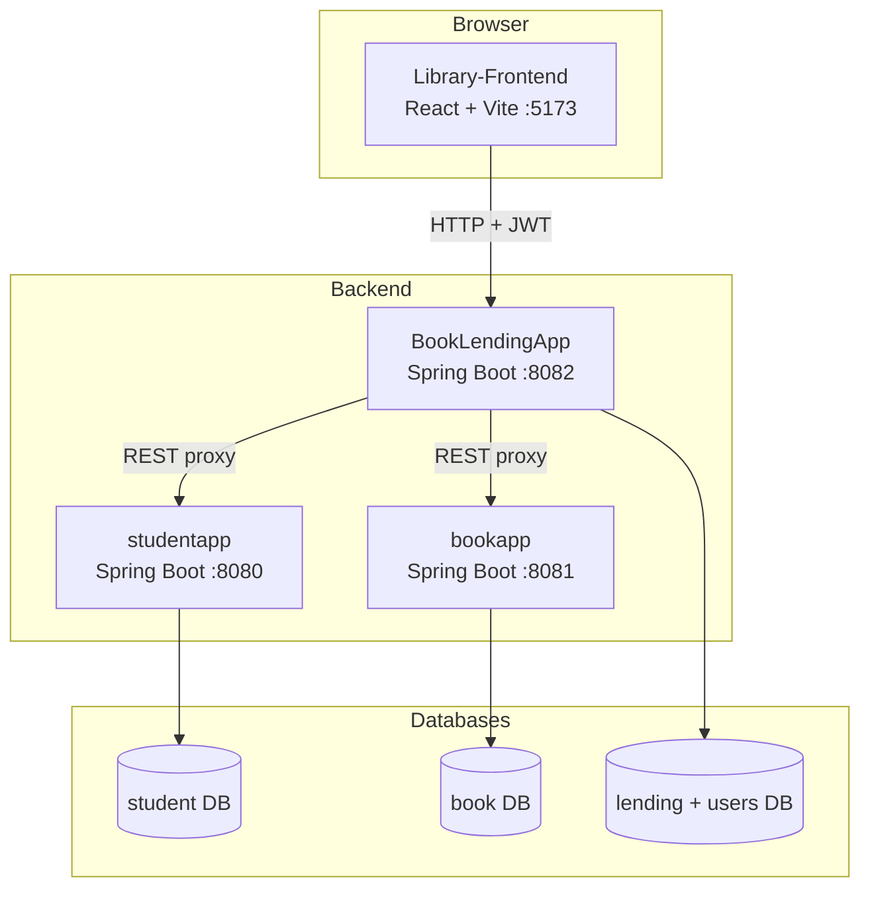
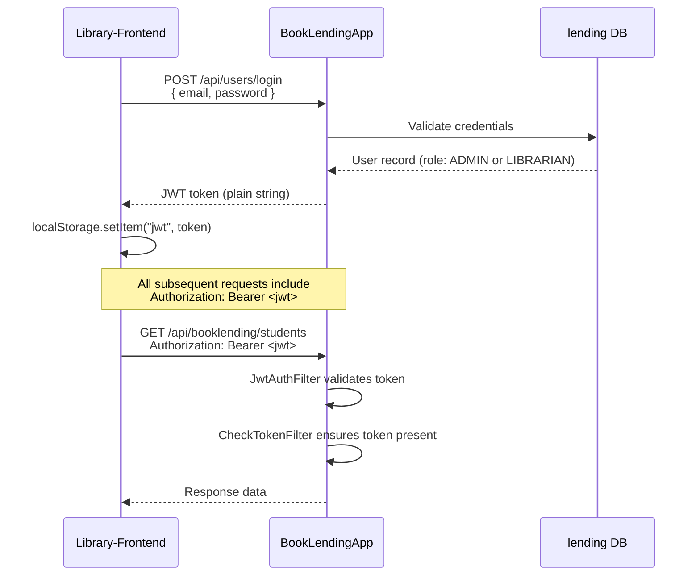
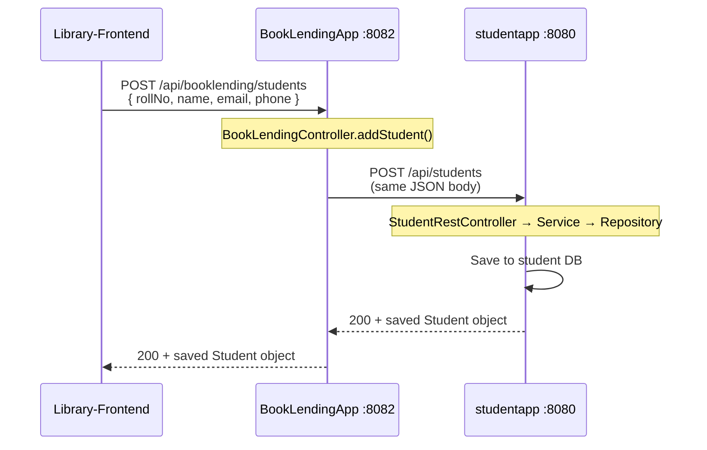
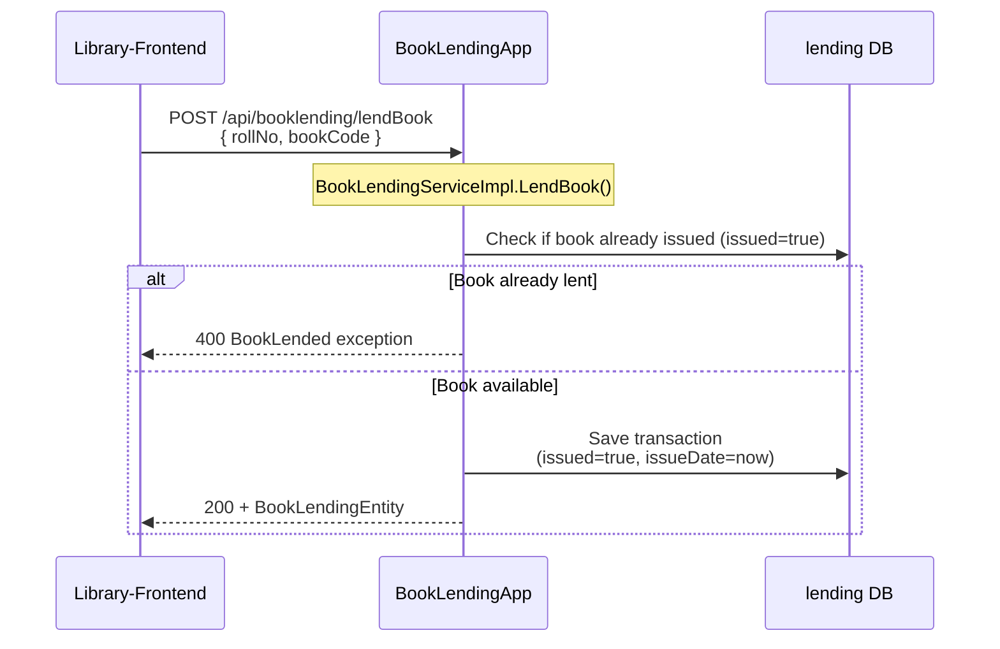
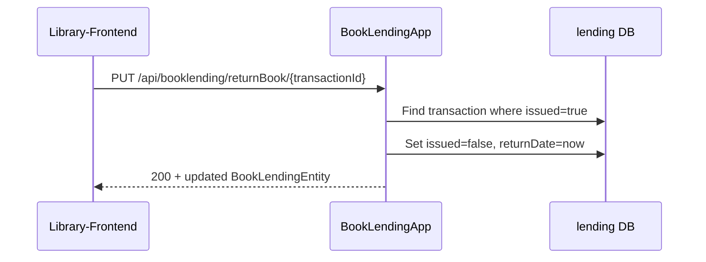
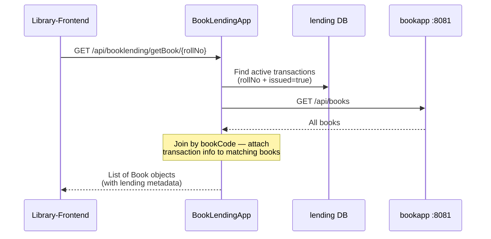
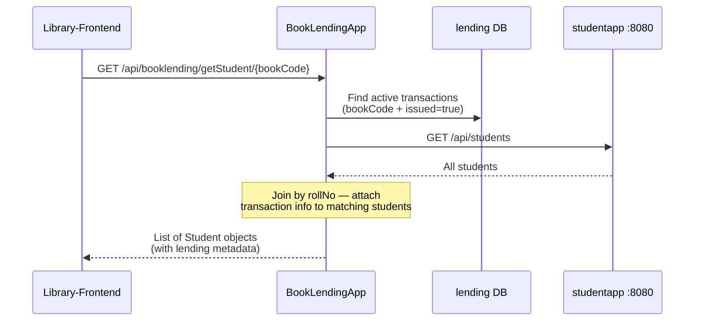

# College Library Project

A distributed microservices application. The system manages a college library across four related repositories: two standalone data microservices, one orchestration backend, and one React frontend.

## Repositories

| Repository | Problem Statement | Role | Default Port |
|------------|-------------------|------|--------------|
| [`studentapp`](./studentapp) | PS1 — Student Details App | Stores and serves student records | `8080` |
| [`bookapp`](./bookapp) | PS2 — Book Details App | Stores and serves book records | `8081` |
| [`BookLendingApp`](./BookLendingApp) | PS3 — Book Lending (Backend) | Auth, lending logic, and API gateway to PS1/PS2 | `8082` |
| [`Library-Frontend`](./Library-Frontend) | PS3 — Book Lending (Frontend) | Web UI for admins and librarians | `5173` |

The frontend never talks directly to `studentapp` or `bookapp`. All browser requests go through `BookLendingApp`, which either handles them locally or proxies them to the appropriate microservice.

## High-Level Architecture



### What each service owns

| Service | Data it stores | Responsibility |
|---------|----------------|----------------|
| `studentapp` | Students (`rollNo`, `name`, `email`, `phone`) | CRUD for student records |
| `bookapp` | Books (`code`, `title`, `author`, `description`) | CRUD for book records |
| `BookLendingApp` | Users (`ADMIN` / `LIBRARIAN`), lending transactions (`transactionId`, `rollNo`, `bookCode`, `issued`, dates) | Authentication, authorization, book lending/returning, proxying student/book CRUD |
| `Library-Frontend` | JWT in `localStorage` | UI for login, admin, librarian workflows |

## User Roles and Frontend Flow

```mermaid
flowchart LR
    Login[/login] --> Dashboard[/dashboard]
    Dashboard --> Students[/students]
    Dashboard --> Books[/books]
    Login --> Admin[/adminlibrarian]

    Students --> StudentDetail[/studentdetails/:rollNo]
    Books --> BookDetail[/bookdetails/:code]
```

1. **Admin** — Logs in and manages librarians (add, view, delete) at `/adminlibrarian`.
2. **Librarian** — Logs in, lands on `/dashboard`, then manages:
   - **Students** — view, add, update, delete students; see which books a student has borrowed.
   - **Books** — view, add, update, delete books; see which student has borrowed a book.

All API calls from the frontend are made via Axios modules in `Library-Frontend/src/API/` (`StudentApi.js`, `baseApi.js`, `TransactionApi.js`). The backend URL is configured in `Library-Frontend/.env` as `VITE_API_URL=http://localhost:8082`.

## Authentication Flow

Authentication is handled entirely by `BookLendingApp` using **JWT** (JSON Web Tokens) and **Spring Security**.



### Security filters (request order)

Every request to `BookLendingApp` passes through two custom filters before reaching a controller:

1. **`JwtAuthFilter`** — Reads the JWT from the `Authorization: Bearer <token>` header, validates it, loads the user, and sets the Spring Security context. For `/api/admin/**` routes, it also checks that the user has the `ADMIN` role.
2. **`CheckTokenFilter`** — Rejects requests that have no JWT, except for `/api/users/**` (login/signup) and Swagger docs.

The frontend stores the JWT in `localStorage` and attaches it to every API call:

```js
headers: { 'Authorization': "Bearer " + localStorage.getItem("jwt") }
```

### Creating the first admin

There are no pre-seeded users. Create an admin after `BookLendingApp` is running:

```powershell
$body = @{
  username = "admin"
  name     = "Admin"
  email    = "admin@library.com"
  password = "admin123"
  role     = "ADMIN"
} | ConvertTo-Json

Invoke-RestMethod -Uri http://localhost:8082/api/users/signup `
  -Method POST -Body $body -ContentType "application/json"
```

## Request Flow by Feature

### 1. Student CRUD (proxied through BookLendingApp)

When a librarian adds a student in the UI, the request travels through two services:



The same proxy pattern applies to all student operations:

| Frontend calls | BookLendingApp proxies to |
|----------------|---------------------------|
| `GET /api/booklending/students` | `GET /api/students` |
| `GET /api/booklending/students/rollNo/{rollNo}` | `GET /api/students/rollNo/{rollNo}` |
| `POST /api/booklending/students` | `POST /api/students` |
| `PUT /api/booklending/students` | `PUT /api/students` |
| `DELETE /api/booklending/students/RollNo/{rollNo}` | `DELETE /api/students/rollNo/{rollNo}` |

`BookLendingApp` uses **RestTemplate** (sync) and **WebClient** (reactive, for list endpoints) to forward requests. The upstream URLs are defined in `BookLendingApp/src/main/java/com/Dockerates/BookLending/Constants.java`.

### 2. Book CRUD (proxied through BookLendingApp)

Identical proxy pattern, but targeting `bookapp`:

| Frontend calls | BookLendingApp proxies to |
|----------------|---------------------------|
| `GET /api/booklending/books` | `GET /api/books` |
| `GET /api/booklending/books/code/{code}` | `GET /api/books/code/{code}` |
| `POST /api/booklending/books` | `POST /api/books` |
| `PUT /api/booklending/books` | `PUT /api/books` |
| `DELETE /api/booklending/books/code/{code}` | `DELETE /api/books/code/{code}` |

### 3. Lend a book (handled locally by BookLendingApp)

Lending does **not** modify `studentapp` or `bookapp`. A transaction record is created in the `BookLendingApp` database.



**Request body** (`BookLendingEntity`):

```json
{
  "rollNo": "101",
  "bookCode": "B001"
}
```

**Response** — the saved transaction including a generated `transactionId`:

```json
{
  "transactionId": 1,
  "rollNo": "101",
  "bookCode": "B001",
  "issued": true,
  "issueDate": "2026-09-20T08:00:00.000+00:00",
  "returnDate": null
}
```

### 4. Return a book (handled locally by BookLendingApp)



### 5. Get books borrowed by a student (aggregation across services)

This is the most complex flow — `BookLendingApp` combines data from its own DB and `bookapp`:



### 6. Get student who borrowed a book (aggregation across services)



### 7. Admin librarian management (handled locally)

| Action | Endpoint | Notes |
|--------|----------|-------|
| List librarians | `GET /api/admin/getLibrarian` | Requires `ADMIN` role in JWT |
| Add librarian | `POST /api/admin/addLibrarian` | Creates user with `LIBRARIAN` role |
| Delete librarian | `DELETE /api/admin/deleteLibrarian/{email}` | Removes librarian by email |

## API Reference

### studentapp (`:8080`)

| Method | Endpoint | Description |
|--------|----------|-------------|
| `GET` | `/api/students` | List all students |
| `GET` | `/api/students/rollNo/{rollNo}` | Get student by roll number |
| `POST` | `/api/students` | Add a student |
| `PUT` | `/api/students` | Update a student |
| `DELETE` | `/api/students/rollNo/{rollNo}` | Delete a student |

### bookapp (`:8081`)

| Method | Endpoint | Description |
|--------|----------|-------------|
| `GET` | `/api/books` | List all books |
| `GET` | `/api/books/code/{code}` | Get book by code |
| `POST` | `/api/books` | Add a book |
| `PUT` | `/api/books` | Update a book |
| `DELETE` | `/api/books/code/{code}` | Delete a book |

### BookLendingApp (`:8082`)

**Auth**

| Method | Endpoint | Description |
|--------|----------|-------------|
| `POST` | `/api/users/signup` | Register a user (any role) |
| `POST` | `/api/users/login` | Login, returns JWT |
| `GET` | `/api/users/logout` | Logout |

**Proxied student/book CRUD** — see tables in [Request Flow](#request-flow-by-feature) above. All routes are under `/api/booklending/`.

**Lending (local)**

| Method | Endpoint | Description |
|--------|----------|-------------|
| `POST` | `/api/booklending/lendBook` | Issue a book to a student |
| `PUT` | `/api/booklending/returnBook/{transactionId}` | Return a borrowed book |
| `GET` | `/api/booklending/getBook/{rollNo}` | Books currently borrowed by a student |
| `GET` | `/api/booklending/getStudent/{bookCode}` | Student who currently has a book |

**Admin**

| Method | Endpoint | Description |
|--------|----------|-------------|
| `GET` | `/api/admin/getLibrarian` | List all librarians |
| `POST` | `/api/admin/addLibrarian` | Add a librarian |
| `DELETE` | `/api/admin/deleteLibrarian/{email}` | Delete a librarian |

Swagger UI is available at `http://localhost:8082/swagger-ui/index.html` when `BookLendingApp` is running.

## Project Structure (per service)

All three Java backends follow the **Controller → Service → Repository** pattern:

```
src/main/java/
├── rest/ or controller/   # REST endpoints (@RestController)
├── service/               # Business logic
├── repository/            # JPA data access
├── entity/                # Database models
├── exception/             # Custom exceptions + global handler
└── config/                # Security, CORS (BookLendingApp only)
```

The frontend is organized by feature:

```
Library-Frontend/src/
├── API/           # Axios functions (one per domain)
├── Components/    # React UI grouped by page/feature
├── config.js      # Backend URL from environment
└── App.jsx        # React Router routes
```

## Technology Stack

| Layer | Technologies |
|-------|-------------|
| Microservices | Java 17, Spring Boot 3.1, Spring Data JPA, Spring Security, Spring WebFlux (WebClient) |
| Databases | H2 (local dev), MySQL/RDS (production) |
| API docs | SpringDoc OpenAPI (Swagger) |
| Frontend | React 18, Vite, Tailwind CSS, Flowbite, Axios, React Router |
| Deployment | Docker, AWS ECS/EC2, ECR, RDS, GitHub Actions CI/CD |

## Local Development

### Prerequisites

- Java 17
- Maven 3.9+
- Node.js 18+

### Setup and run

```powershell
# From the AcademiaArchive root directory

# Install dependencies and build all services (first time)
.\setup.ps1

# Start all four services in separate terminal windows
.\start-all.ps1
```

| Service | URL |
|---------|-----|
| Frontend | http://localhost:5173 |
| BookLendingApp | http://localhost:8082 |
| studentapp | http://localhost:8080 |
| bookapp | http://localhost:8081 |

### Configuration

| File | Purpose |
|------|---------|
| `studentapp/src/main/resources/application.properties` | Port 8080, H2 student DB |
| `bookapp/src/main/resources/application.properties` | Port 8081, H2 book DB |
| `BookLendingApp/src/main/resources/application.properties` | Port 8082, H2 lending DB |
| `BookLendingApp/.../Constants.java` | URLs for `studentapp` and `bookapp` |
| `Library-Frontend/.env` | `VITE_API_URL` pointing to BookLendingApp |

> `application.properties` files are gitignored in the Java repos (they are generated during AWS deployment via GitHub Actions). Local copies are created for development.

## Production Deployment

In production, each service runs as a Docker container on AWS ECS with its own EC2 instance. GitHub Actions workflows (`.github/workflows/aws.yml` in each repo) build the image, push to ECR, and deploy to ECS. Production uses MySQL on AWS RDS instead of H2.

The deployed architecture mirrors the local one — the frontend calls the BookLendingApp public IP, which in turn calls the public IPs of `studentapp` and `bookapp` (configured in `Constants.java` and the frontend API files).

## Error Handling

Each microservice has its own exception handling:

- **studentapp** — `StudentNotFoundException`, `StudentAlreadyExistsException`, `NullFieldsException`
- **bookapp** — `BookNotFoundException`, `BookAlreadyExistsException`, `NullFieldsException`
- **BookLendingApp** — `BookLended`, `UserNotFoundException`, `UserWrongPasswordException`, plus propagated errors from upstream services

Errors are returned as JSON with HTTP status codes (400, 404, etc.) and displayed in the frontend via modal components.
